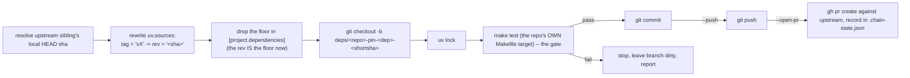

# ci/bump_downstream.py

Drives the contracts → ledger → engine → traust pin chain. Lives here
because contracts sits at the root — every one of ledger, engine, and traust
carries a **direct** `[tool.uv.sources]` pin on contracts (not just a
transitive one through each other), so a contracts change is the most common
trigger for the whole walk. See each repo's `AGENTS.md`/`CONTRIBUTING.md`
"Downstream pin(s)" section for the short version; this file is the
how-it-works and troubleshooting companion.

Bridges the manual propagation toil until the platform-API work lands and
reshapes what "downstream" even means for these repos — not the permanent
answer, just the thing that replaces four hand-edited `pyproject.toml`s and a
changelog-reading guessing game with one deterministic command.

Assumes the mono-checkout layout: this repo and ledger/engine/traust are
sibling directories. Default root is computed from this file's own location
(`ci/bump_downstream.py` → `traust-contracts` → its parent); override with
`TRAUST_CHAIN_ROOT` if your checkout differs. This never touches the network
except through `uv lock`, `git push`, and `gh`.

## What one hop does (`bump <target>`)



A failing test *is* the breaking-change signal — propagation stops there
instead of you reading three changelogs to guess if it's safe.

## Chain topology (hardcoded in `CHAIN`)

| Repo | Pins (upstream deps it tracks) |
|---|---|
| `traust-contracts` | none (root) |
| `traust-ledger` | `traust-contracts` |
| `traust-engine` | `traust-contracts`, `traust-ledger` |
| `traust` | `traust-contracts`, `traust-ledger`, `traust-engine` |

Each hop reads its upstream dep's **local, currently-checked-out HEAD** —
after a hop runs, that repo sits on its new branch, so the *next* hop picks up
the branch tip, not `main`. That's what lets the chain walk PR-to-PR without
waiting for merges in between.

## Commands

```
python3 ci/bump_downstream.py status
python3 ci/bump_downstream.py bump ledger|engine|traust [--push] [--open-pr]
python3 ci/bump_downstream.py chain [--push] [--open-pr]
python3 ci/bump_downstream.py reconcile [ledger|engine|traust]
```

Or via `make` (run from this repo's root):

| Make target | Effect |
|---|---|
| `make downstream-status` | Drift report, read-only |
| `make downstream-bump-ledger` / `-engine` / `-traust` | One hop, local commit only, nothing pushed |
| `make downstream-chain` | All three hops in order, local only, stops at first test failure |
| `make downstream-chain-push` | Same, pushing each hop's branch right after its commit |
| `make downstream-chain-pr` | Same, push + `gh pr create` against `traust-security/*` at each hop |
| `make downstream-reconcile` | Fix pins left dangling by a squash/rebase merge |

(No single-hop `-pr` targets wired into the Makefile today — call the script
directly with `bump <target> --open-pr` if you need just one.)

## Example: `make downstream-status`

```
traust-contracts: HEAD 947b05f
traust-ledger: HEAD 945e544  pins: traust-contracts=origin/main:947b05f (pinned 104519f, BEHIND(4))
traust-engine: HEAD eab3aa6  pins: traust-contracts=origin/main:947b05f (pinned 104519f, BEHIND(4)), traust-ledger=origin/main:945e544 (pinned d28490a, BEHIND(6))
traust: HEAD 2ad90c1  pins: traust-contracts=origin/main:947b05f (pinned 104519f, BEHIND(4)), traust-ledger=origin/main:945e544 (pinned d28490a, BEHIND(6)), traust-engine=origin/main:b8ec452 (pinned 248746b, BEHIND(2))
```

Three states per pin, not two -- reachability (does `reconcile` need to act)
and currency (does `bump` have new work to do) are different questions:

| State | Meaning | Who acts on it |
|---|---|---|
| `CURRENT` | pinned sha IS the dependency's `origin/main` tip | nobody, nothing to do |
| `BEHIND(n)` | pinned sha is reachable (an ancestor), but `origin/main` has moved `n` commits past it | you -- run `make downstream-bump-<hop>` to pick up the new commits. Not an error; this is the normal in-between-bumps state |
| `DANGLING` | pinned sha isn't reachable from `origin/main` at all (squash/rebase orphaned it) | `make downstream-reconcile` |

`BEHIND` is informational by design -- `status` will never auto-advance a pin
just because it's reporting one, same as `reconcile` never does. Both only
ever *tell* you about `BEHIND`; only `bump` (deliberately, on request) moves
a pin forward to new content. `DANGLING` is the only state `reconcile` acts
on, and only because squash/rebase genuinely orphaned the commit -- it isn't
"new commits exist," it's "the one you had stopped existing on `main`."

Every repo behind the one in front of it — this is the normal starting state.

## Example: `make downstream-bump-ledger`

```
[deps/ledger-pin-contracts-104519f 47b0dba] chore(deps): pin traust-contracts@104519f
 2 files changed, 4 insertions(+), 4 deletions(-)
==> test traust-ledger
1004 passed, 14 skipped in 23.89s
traust-ledger: committed on deps/ledger-pin-contracts-104519f (chore(deps): pin traust-contracts@104519f)
```

`pyproject.toml` diff it produced:

```diff
-    "traust-contracts>=0.47.0",
+    "traust-contracts",
...
-traust-contracts = { git = "...traust-contracts.git", tag = "v0.48.1" }
+traust-contracts = { git = "...traust-contracts.git", rev = "104519fd18f724e121c492c160e3dc2d67408f90" }
```

`status` right after confirms ledger is current and shows engine/traust now
drifted off ledger's **new** HEAD (the branch tip, since nothing merged yet):

```
traust-ledger: HEAD 47b0dba  pins: traust-contracts=104519f (upstream 104519f)
traust-engine: HEAD 399bca3  pins: ..., traust-ledger=v0.8.5 (upstream 47b0dba DRIFT)
```

Nothing pushed. Branch sits locally for you to review:

```
git -C ../traust-ledger push -u origin deps/ledger-pin-contracts-104519f
```

## Full stacked-PR walk

```
make downstream-chain-pr
```

walks all three hops in order: pins, tests, commits, pushes, and opens a PR
against `traust-security/*` at each one before moving to the next. Each
hop's PR diffs against `main`, so engine's PR will show ledger's
not-yet-merged change too until ledger's PR lands — normal for stacked PRs,
just don't be surprised by it in review.

## After PRs merge: `make downstream-reconcile`

Validity after a merge is **reachability, not sha equality** — a "create a
merge commit" merge mints a brand-new 2-parent tip on `main` every time, so
the pinned sha is essentially never literally equal to `origin/main`'s tip
even when the pin is perfectly current. The original pinned commit is still
permanently in `main`'s history, just not its literal HEAD. Only **squash and
rebase merges actually orphan** the pinned sha (not reachable from `main` at
all afterward) — that's the one case that needs a re-pin.

`reconcile` checks each of a hop's pins directly against its dependency's own
`origin/main` (`git merge-base --is-ancestor`), not against any locally
tracked PR state — an earlier version compared the hop's own merge-commit
sha against a stored `head_sha` field that actually held a *different*
repo's commit (the trigger dependency's sha, recorded for a different
purpose: resolving what to re-pin to on a retry, not identifying the hop's
own resulting commit). Comparing across two repos' object graphs isn't "a
stale pin," it's a type error — surfaced as `fatal: Not a valid commit name
<sha>` the first time this ran against real merged PRs. Fixed: reachability
is now checked per-pin, per-dependency, with no cross-repo sha confusion:

1. For each pin this hop carries: fetch that dependency's `origin`, check if
   the pinned sha is `origin/main` or an ancestor of it.
2. All reachable → "nothing to reconcile", regardless of merge method used
   upstream or whether a PR number was ever tracked for it.
3. Any not reachable (squash/rebase did happen) → re-pin every pin on this
   hop to each dependency's current `origin/main` tip, `uv lock`, re-test,
   then:
   - hop's own PR still open → pushes the fix to that same branch
   - hop's own PR already merged too → prints a message telling you to
     run `make downstream-bump-<hop>` fresh instead of auto-chaining a new PR

## Fork safety (origin vs upstream)

Every repo here has two remotes: `origin` (your fork) and `upstream`
(`traust-security/*`). Three things that would otherwise silently use the
wrong one are guarded explicitly:

- **Shas are never trusted from raw local HEAD.** `verified_head()` fetches
  `origin` and requires local HEAD to equal `origin/main` or be a descendant
  of it (the normal state mid-chain, before you've pushed). A stale,
  diverged, or accidentally-checked-out-elsewhere repo raises instead of
  quietly pinning against whatever happened to be on disk. `status` does the
  same check read-only and flags it as `CHECKOUT-STALE` instead of raising.
- **`PinWriter` retargets the git URL, not just the rev.** Every repo's
  committed `uv.sources` points at `https://github.com/traust-security/*`
  (upstream) by default. This chain only ever pushes to `origin`. If the URL
  stayed pointed at upstream, `uv lock` would try to fetch the new sha from a
  remote that never received it and fail with `failed to find branch, tag,
  or commit <sha>` — hit this for real before the fix. `pin()` now rewrites
  both the url and the rev to `origin`'s slug.
- **Preflight checks the sha is actually on `origin` before locking.**
  `Git.remote_has()` fetches and checks `git branch -r --contains <sha>` for
  an `origin/*` ref. A hop whose upstream dep was bumped without `--push`
  fails fast with "push {dep}'s branch first", instead of a confusing `uv
  lock` git error three steps later.
- **`gh` calls are always `--repo`'d explicitly.** Left to its own defaults,
  `gh` prefers a remote literally named `upstream` over `origin` for repo
  resolution — confirmed here: `gh repo view` with no flags resolved to the
  upstream repo, not the fork, even though every branch this script creates
  is pushed to `origin` only. `origin_slug()`/`upstream_slug()` parse the
  real targets from `git remote get-url <remote>` so this can't drift.

## PRs target upstream, cross-repo

`gh pr create`/`gh pr view` target `upstream` (`traust-security/*`) as
`--repo`, with `--head <fork-owner>:<branch>` — head and base live in
different repos, so the owner qualifier on `--head` is required (gh silently
looks for the branch in the base repo otherwise). `uv.sources` pins still
target `origin` (the sha only ever lives on your fork until the PR merges) —
only the PR's repo target is `upstream`.

## Push is not optional past the first hop

`uv lock` resolves purely over the network from the URL in `uv.sources` —
it has no idea the sibling repo sits right there on disk. So **every hop
beyond the first needs its upstream dep already pushed to `origin`** before
it can succeed. `make downstream-chain` (no push) only really works for a
single hop whose dep is already fully in sync with `origin/main`; use `make
downstream-chain-push` or `downstream-chain-pr` as the normal way to run this
end to end.

The dirty-tree guard distinguishes three states, not two: unrelated local
changes block with an error; a previous failed attempt on this hop's own
branch resumes (re-tests, doesn't re-checkout); a hop whose branch is already
fully committed (and maybe already pushed) is detected and skipped straight
to the push/PR step instead of trying to re-commit nothing.

## Gate = `make test`, not a hardcoded pytest call

Each repo's `make test` differs and that difference matters:

| Repo | `make test` |
|---|---|
| contracts | `uv run pytest tests/ -q` |
| ledger | `uv run pytest tests/ -q -m "not integration"` |
| engine | `uv run pytest tests/ -q -m "not integration"` |
| traust | `uv run pytest tests/ -n auto` (parallel, pytest-xdist) |

A hardcoded `uv run pytest tests/ -q` for every hop would run slower than
necessary against traust (serial instead of `-n auto`) and, worse, run
integration tests against ledger/engine that their own `make test`
deliberately excludes. Every hop shells out to `make test` in that repo
instead, so the gate always matches what the repo itself considers "tests
pass."

## Known rough edges

- Doesn't touch inline comments next to a dropped floor (e.g. ledger's
  `# 0.1.1 is the floor...`) — glance at the diff per hop.
- `reconcile` won't auto-recurse past a hop whose own PR already merged;
  that's deliberate, keeps a human in the loop for cascades.
- Assumes `gh` is authenticated and the mono-checkout layout matches (sibling
  directories, `origin`/`upstream` remotes named as such).
