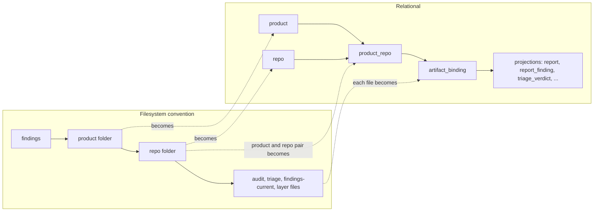
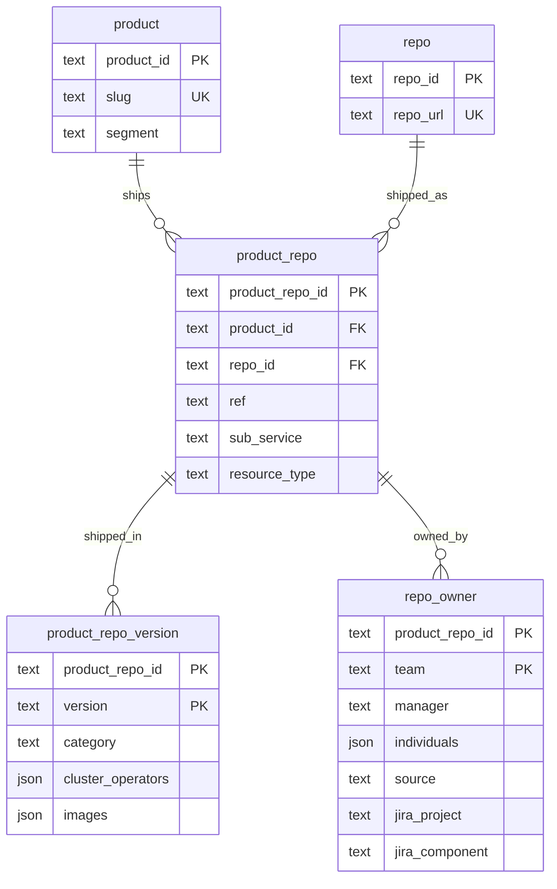
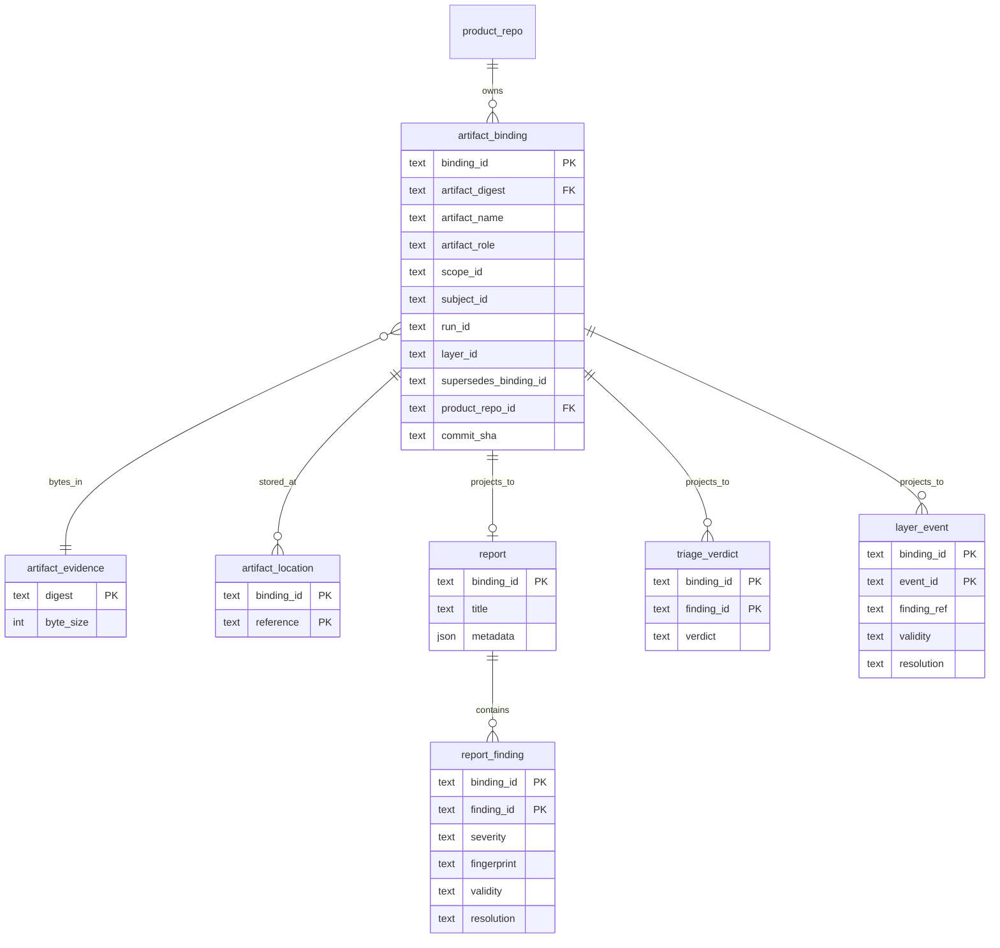
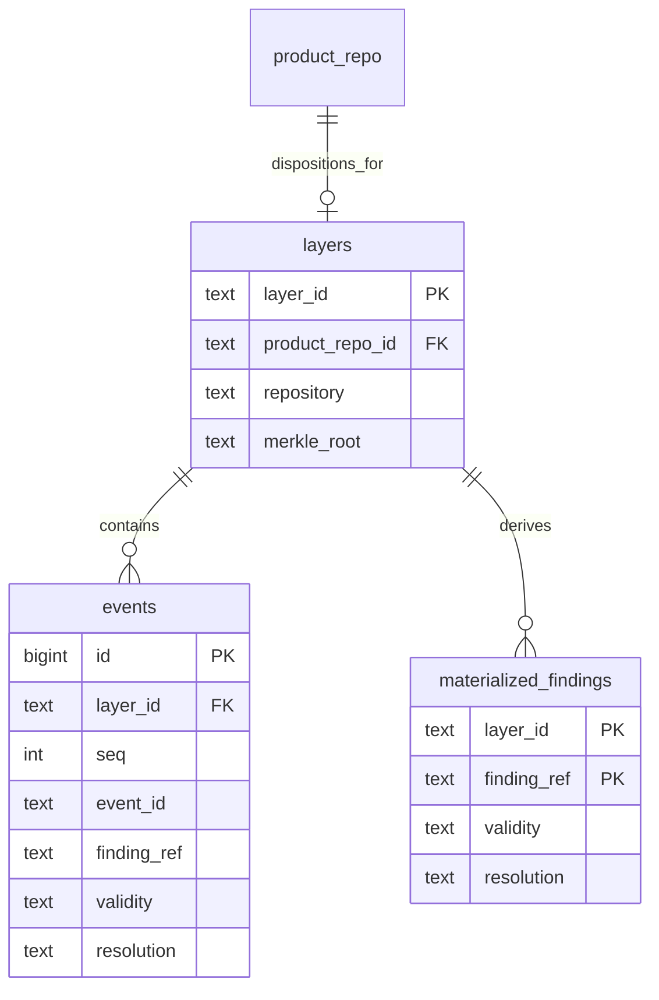

# Data model

How the storage and ledger tables relate. The SQL under `storage/v1/` and
`ledger/v1/` is the source of truth; these diagrams show the shape. Keys:
`PK` primary key, `FK` foreign key, `UK` unique (natural key).

## From folders to tables

What used to be a folder convention on disk (`findings/<product>/<repo>/`) is
relational: every artifact is filed under a registered product and repo.



## Registry and inventory

Products and repos are many-to-many. A `product_repo` is a repo as a product
ships it, at one ref (`''` = default branch, `release-5.0` = a release
branch). Inventory facts hang off it.



| Table | Natural key (unique) | Notes |
|---|---|---|
| `product` | `slug` | `segment` = inventory grouping (openshift, operator-catalog, services, ...) |
| `repo` | `repo_url` | exact string; not canonicalized |
| `product_repo` | `(product_id, repo_id, ref)` | the owner of artifacts and ledger layers |
| `product_repo_version` | `(product_repo_id, version)` | which product versions ship it |
| `repo_owner` | `(product_repo_id, team)` | several teams may own one product_repo |

Primary keys are database identifiers (UUIDs the Store assigns).
`Store.register_*` insert or refresh by natural key and return the id;
`Store.find_product_repo(slug, repo_url, ref)` looks one up without creating it.

## Artifacts

An artifact's bytes are stored once (`artifact_evidence`, keyed by digest);
each filing of those bytes in a context is a binding; every artifact type
projects into its own table keyed by the binding.



- `binding_id` is a hash of the binding context (digest, artifact, scope,
  subject, run, layer, role), so a retry of the same filing is idempotent.
  `product_repo_id` and `commit_sha` are constrained attributes, not part of it.
- Every projection table (about 40) references `artifact_binding`; only a few
  are drawn. `profiles.json` maps each artifact to its projection.
- A `report` with role `cumulative` is the findings-current view; one chain of
  them is current per `(scope_id, product_repo_id, run_id)`.

## Ledger (optional)

The ledger records dispositions over time. It is optional; storage is always
present when a database is used, so the ledger references storage and never
the reverse (same database, storage initialized first).



`layers.product_repo_id` is unique when set: one layer per product_repo.
Events are append-only (`UNIQUE (layer_id, seq)`, `UNIQUE (layer_id, event_id)`).

## Joining it together

A product_repo's current findings with their disposition history:

```sql
SELECT pr.product_repo_id, rf.finding_id, rf.severity, e.recorded_at, e.validity, e.resolution
FROM traust_storage.product_repo     pr
JOIN traust_storage.artifact_binding b  ON b.product_repo_id  = pr.product_repo_id
JOIN traust_storage.report_finding   rf ON rf.binding_id      = b.binding_id
JOIN traust_ledger.layers            l  ON l.product_repo_id  = pr.product_repo_id
JOIN traust_ledger.events            e  ON e.layer_id         = l.layer_id
                                       AND e.finding_ref      = rf.finding_id;
```

`finding_id` / `finding_ref` are scoped to a report, so the finding join only
holds inside one product_repo (as above). Repos a product ships but nobody has
scanned are `product_repo` rows with no `artifact_binding`.

## Revisions

Storage and ledger schemas carry a revision (`traust_storage_meta`,
`schema_revision`); both were rebaselined to revision 1 in 0.50.0. How
revisions and `Store.migrate()` work: [storage/v1/README.md](../storage/v1/README.md),
"Compatibility" and "Migrations".
