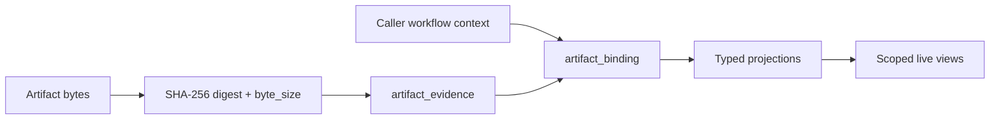

# Storage v1

Storage v1 records artifact evidence metadata and binds it to caller-owned
workflow context. Artifact bytes live in the caller's object store; storage
retains the content-addressed digest and byte size. SQL is the data model; [JSON Schemas](../../schemas/v1/) validate
artifact interpretations.

| Database | Driver | Scoped dashboard |
|---|---|---|
| [SQLite](sqlite/) | Standard-library `sqlite3` | Explicit scope list in the query |
| [PostgreSQL 14+](postgres/) | `psycopg>=3` + libpq, or `psycopg[binary]` | Fixed `traust_storage` schema; transaction-local `traust.scope_ids` plus explicit query scope |



## Ledger integration

The [Traust Ledger](../../ledger/v1/) is optional. Without it, storage provides
artifact projections, findings, ownership, and point-in-time posture views.
With the ledger, storage additionally provides the time dimension:

| Capability | Without ledger | With ledger |
|---|---|---|
| Current findings and posture | ✓ | ✓ |
| Ownership and census | ✓ | ✓ |
| Validation and verification | ✓ | ✓ |
| Finding timeline (first adjudicated, resolved, regression) | — | ✓ |
| SLA clock and breach detection | report date only | event-accurate |
| Exposure trend (opened/closed per month) | — | ✓ |
| MTTR and duration metrics | — | ✓ |

The ledger produces layer artifacts (`layer.schema.json`) containing an
append-only event stream. Storage projects those events into `layer_event`
rows, which the timeline views consume via LEFT JOIN. When no layer artifacts
are ingested, those views return NULL for their clock columns — degraded, not
broken.

## Identity model

| Identity | Meaning |
|---|---|
| `digest` | SHA-256 of exact source bytes; evidence identity only |
| `binding_id` | Deterministic association of evidence, schema name, and context |
| `scope_id` | Authorization/deployment partition; defaults to `local` |
| `subject_id` | Optional stable analyzed target supplied by the host |
| `run_id` | Optional execution/result occurrence supplied by the host |
| `layer_id` | Optional Traust Ledger disposition-layer identity |
| `role` | Optional lifecycle role within one context, from the artifact's `roles` in `profiles.json` |

Storage treats caller identifiers as opaque UTF-8 strings. It rejects NUL
because PostgreSQL `TEXT` cannot represent it. Storage does not parse or
normalize repository fields, URLs, paths, or external project IDs.

`project_id` is not part of storage v1. External project identifiers inside an
artifact remain domain evidence and never become authorization scope implicitly.

## Binding identity

```text
sha256(
  "traust-binding-v1" 0x00
  artifact_digest     0x00
  artifact_name       0x00
  scope_id            0x00
  optional(subject_id)
  optional(run_id)
  optional(layer_id)
  [0x01 role 0x00]      -- only when role is present
)

optional(value):
  absent  = 0x00
  present = 0x01 value 0x00
```

Fields are UTF-8 bytes without Unicode normalization. The presence marker
distinguishes absent from present-empty values. `role` is trailing and
present-only, so a binding without a role hashes exactly as it did before
roles existed; every existing `binding_id` is unchanged.

Golden vector:

```text
artifact_digest = e3b0c44298fc1c149afbf4c8996fb92427ae41e4649b934ca495991b7852b855
artifact_name   = triage
scope_id        = local
subject_id      = sci:inventory-item:42
run_id          = absent
layer_id        = absent
binding_id      = 90933ec74bd66618428c4def90f4af4cb9a2ab60bc9bd24a20b64814ca2dba56
```

With a role (same digest, `artifact_name = report`, `role = baseline`):

```text
binding_id      = d0da85a98aa803d79ba2fed07a8f991c706f2fbb44f3692cbd3ad8662961cb0b
```

## Roles

Some artifacts are legitimately bound more than once to the same context.
A repo's plain audit and its disposition-aware findings-current restatement
both validate as `report`, for the same subject and scanned commit. Without a
role their bindings are indistinguishable. `profiles.json` declares the roles
an artifact accepts; `report` accepts `baseline` and `cumulative`. A role is
optional, rejected when the profile does not declare it, part of the binding
identity, and must match across a supersession.

## Artifact locations

Storage does not keep artifact bytes or choose where they live. A caller that
has already written the exact bytes somewhere registers that location as an
opaque `reference` on the binding, so a consumer can look the bytes up or
stream them to a user later.

| Rule | Behavior |
|---|---|
| Keyed by | `(binding_id, reference)` — a location belongs to the context that wrote it; dedup of identical bytes across scopes stays private |
| Many | One binding may register several references (mirrors, copies) |
| Retry | Re-saving the same binding may add references; none is removed |
| Content | Opaque UTF-8, never parsed, fetched, or verified by storage |

A reference must resolve to **these exact bytes** for as long as the binding
is read. A path into a mutable store (a git working tree, an overwritten
object key) is not enough on its own: the next rescan replaces the bytes
behind it. Pin it — a digest-addressed key, a commit (`git+<repo>@<sha>:<path>`),
or an object version — so the consumer can still fetch the bytes later and
check them against `artifact_digest`.

## The schema is the reference

A projection or a view is correct when it carries what the **JSON Schema
declares**, not when its numbers agree with some other projection of the
same artifact. Two projections that drop the same fields agree perfectly
and are both wrong: `advisory_exposure` reconciled exactly with a legacy
SQLite projection on every classification bucket while both were dropping
26 of the 40 fields `impact-analysis.schema.json` declares — every piece
of evidence explaining HOW a classification was reached.

So, when adding or reviewing a view:

1. Open the schema for the artifact it reads. Not another database, not a
   dashboard, not a prior projection.
2. Every field the contract declares on the item being fanned out reaches
   SQL, or is listed in `tests/test_view_contract_coverage.py::EXEMPT`
   with a reason a reviewer can disagree with. "Not needed yet" is not a
   reason — an unexposed field is unreachable no matter what is loaded.
3. Per-item fields are projected as COLUMNS, never joined out of the blob
   at query time. Matching an id against every entry of the same array is
   quadratic per artifact.
4. Row counts in one store say nothing about schema completeness. An
   empty table is not an argument against declaring a view.

`test_view_contract_coverage.py` enforces 1–2 mechanically, in both
dialects.

`report_finding.blocked_external` is a nullable INTEGER on both dialects:
1 means explicitly blocked, 0 explicitly not blocked, and NULL means no flag
was stated. It is independent of `remediation_effort`. A historical
`blocked-external` effort string is retained as written and does not cause a
flag or a size to be inferred. The owning report's JSON remains intact.

## Storage profiles

[`profiles.json`](profiles.json) is the hand-authored context/projection policy.
It covers every artifact schema exactly. Classes are `evidence-only`,
`run-bound`, `layer-bound`, `scope-ref`, or `aggregate`; each profile declares
required binding fields and its schema-specific projection table.

Every artifact contract has a durable SQL projection. Root scalars become typed
columns; nested objects and arrays remain JSON/JSONB until a query justifies
child tables. The common projection envelope is `binding_id` plus
`artifact_digest`; scope, subject, run, and layer context remain on
`artifact_binding`.

The first deeply exercised query slice is:

- `vuln-findings`: requires `subject_id` and `run_id`;
- `triage`: requires `subject_id` and `run_id`;
- `layer`: requires `layer_id`.

This slice limits the initial dashboard, not storage coverage. Every other
projection retains generated save and smoke-test coverage.

## Operations

| Operation | Rule |
|---|---|
| Initialize | Fresh databases bootstrap with the package's storage metadata; mismatches require explicit migration. |
| Save | Validate bytes, compute digest and byte size, acquire one digest lock on PostgreSQL, insert evidence record, insert binding, and write any projection in one transaction. Raw payload is not retained. |
| Retry | The same binding returns `AlreadyBound` and only registers any new references. Evidence-level deduplication stays private. |
| Correct | A new binding names `supersedes_binding_id`; clocks never determine correction order. |
| Read binding | Select by binding ID; return the binding record, its role, its registered references, and the evidence `byte_size`, without a payload claim. |

`supersedes_binding_id` is a nullable soft reference. A successor must match its
predecessor's scope, artifact name, subject, run, and layer context. One binding
may have at most one direct successor. The `current_binding` view returns
bindings with no successor in the same scope.

PostgreSQL uses one advisory transaction lock derived from the first eight
digest bytes. Binding idempotency relies on its primary key; there is no second
advisory lock.

## Scoped views

Scoped views compose current bindings with schema projections. They correlate
workflow context through scope, subject, and run identifiers and may enrich
display data through optional layer bindings. They never derive repository
identity from artifact strings. Dashboard-specific metrics and additional
relational projections remain consumer-driven work.

PostgreSQL sets a JSON scope list in transaction-local `traust.scope_ids` and
reads the security-barrier view on the same connection and transaction. SQLite
applies the same JSON scope list in the list query.

## SQL ownership

Each database has one authored file per table, parameterized queries under
`queries/`, and one file per view. Evidence and binding tables bootstrap before
projection tables; views follow in dependency order. Edit SQL directly. SDKs
generate private query bindings from this canonical source.

PostgreSQL relations live in the fixed `traust_storage` schema and every
canonical relation reference is qualified. Initialization creates the schema if
it is absent. Restricted deployments may create it beforehand and grant the
writer role `USAGE` plus the required object privileges. The fixed namespace
prevents application tables or caller-controlled `search_path` entries from
shadowing storage relations. SQLite has no equivalent pooled schema boundary;
the caller-selected database file is its physical namespace, and a dedicated
file is recommended.

The database FK from binding to evidence, and projection FKs to both, protect
storage-internal integrity. Cross-artifact domain references remain soft.

## Compatibility

Earlier experimental schemas were never published or used and have no migration
contract. Recreate those databases rather than treating them as storage v1.

Storage revision 3 adds the nullable blocking column.
`init()` stamps fresh databases and rejects an older revision before altering
its schema or rows. No automatic or live database migration is included here;
an existing store requires separately reviewed operator provisioning.
Historical reports and events remain schema-readable without rewriting them.

## Checks

```bash
make lint-fix
make test
```

PostgreSQL tests use the fixed local test DSN. They run when `psycopg` and the
database are available; otherwise they warn and skip.
