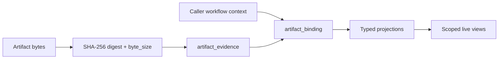
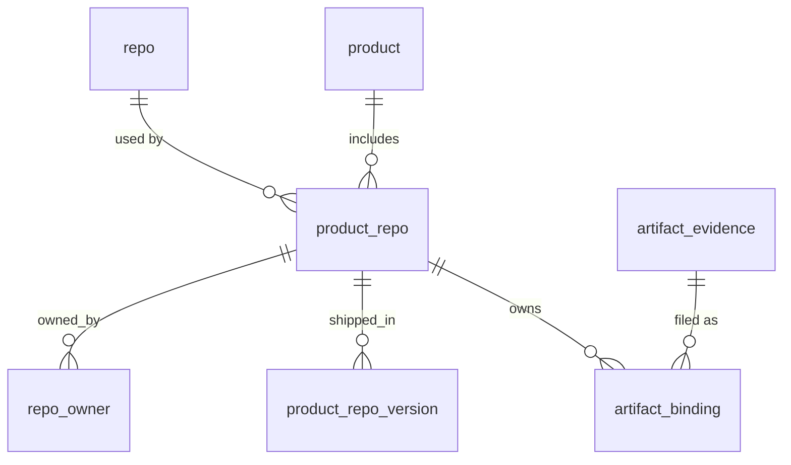

# Storage v1

Storage v1 records artifact evidence metadata and binds it to caller-owned
workflow context. Artifact bytes live in the caller's object store; storage
retains the content-addressed digest and byte size. SQL is the data model; [JSON Schemas](../../schemas/v1/) validate
artifact interpretations.

| Database | Driver | Scoped dashboard |
|---|---|---|
| [SQLite](sqlite/) | Standard-library `sqlite3` | Explicit scope list in the query |
| [PostgreSQL 14+](postgres/) | `psycopg>=3` + libpq, or `psycopg[binary]` | Fixed `traust_storage` schema; transaction-local `traust.scope_ids` plus explicit query scope |



## Ledger integration

The [Traust Ledger](../../ledger/v1/) is optional. Without it, storage provides
artifact projections, findings, ownership, and point-in-time posture views.
With the ledger, storage additionally provides the time dimension:

| Capability | Without ledger | With ledger |
|---|---|---|
| Current findings and posture | ✓ | ✓ |
| Ownership and census | ✓ | ✓ |
| Validation and verification | ✓ | ✓ |
| Finding timeline (first adjudicated, resolved, regression) | — | ✓ |
| SLA clock and breach detection | report date only | event-accurate |
| Exposure trend (opened/closed per month) | — | ✓ |
| MTTR and duration metrics | — | ✓ |

The ledger produces layer artifacts (`layer.schema.json`) containing an
append-only event stream. Storage projects those events into `layer_event`
rows, which the timeline views consume via LEFT JOIN. When no layer artifacts
are ingested, those views return NULL for their clock columns — degraded, not
broken.

## Identity model

| Identity | Meaning |
|---|---|
| `digest` | SHA-256 of exact source bytes; evidence identity only |
| `binding_id` | Deterministic association of evidence, schema name, and context |
| `scope_id` | Authorization/deployment partition; defaults to `local` |
| `subject_id` | Optional stable analyzed target supplied by the host |
| `run_id` | Optional execution/result occurrence supplied by the host |
| `layer_id` | Optional Traust Ledger disposition-layer identity |
| `role` | Optional lifecycle role within one context, from the artifact's `roles` in `profiles.json` |
| `product_repo_id` | Optional registered owner of the binding (see [Product → repo registry](#product--repo-registry)); a foreign key, so it must exist |

Storage treats caller identifiers as opaque UTF-8 strings. It rejects NUL
because PostgreSQL `TEXT` cannot represent it. Storage does not parse or
normalize repository fields, URLs, paths, or external project IDs.

`project_id` is not part of storage v1. External project identifiers inside an
artifact remain domain evidence and never become authorization scope implicitly.

## Binding identity

```text
sha256(
  "traust-binding-v1" 0x00
  artifact_digest     0x00
  artifact_name       0x00
  scope_id            0x00
  optional(subject_id)
  optional(run_id)
  optional(layer_id)
  [0x01 role 0x00]      -- only when role is present
)

optional(value):
  absent  = 0x00
  present = 0x01 value 0x00
```

Fields are UTF-8 bytes without Unicode normalization. The presence marker
distinguishes absent from present-empty values. `role` is trailing and
present-only, so a binding without a role hashes exactly as it did before
roles existed; every existing `binding_id` is unchanged. `product_repo_id`
and `commit_sha` are not part of the identity: they are constrained attributes
of the binding (see the registry below).

Golden vector:

```text
artifact_digest = e3b0c44298fc1c149afbf4c8996fb92427ae41e4649b934ca495991b7852b855
artifact_name   = triage
scope_id        = local
subject_id      = sci:inventory-item:42
run_id          = absent
layer_id        = absent
binding_id      = 90933ec74bd66618428c4def90f4af4cb9a2ab60bc9bd24a20b64814ca2dba56
```

With a role (same digest, `artifact_name = report`, `role = baseline`):

```text
binding_id      = d0da85a98aa803d79ba2fed07a8f991c706f2fbb44f3692cbd3ad8662961cb0b
```

## Product → repo registry

The registry is the parent every binding can reference. Products and repos are
many-to-many: a library scanned for several products is one `repo` and one
`product_repo` per product. A `product_repo` is a repo as a product ships it,
at one ref (`''` for the default branch, `release-5.0` for a release branch the
product ships); each has its own audits and its own ledger. It replaces the
`findings/<product>/<repo>/` folder: every artifact binding references one.



| Table | Primary key | Natural key (unique) |
|---|---|---|
| `product` | `id` | `slug` |
| `repo` | `id` | `repo_url` (exact string) |
| `product_repo` | `id` | `(product_id, repo_id, ref)`; `ref` is `''` for the default branch |

Primary keys are database-generated numeric identifiers (`BIGINT GENERATED ALWAYS AS
IDENTITY` in PostgreSQL, `INTEGER PRIMARY KEY` in SQLite); the database
enforces uniqueness on the natural keys. Child FKs retain descriptive names
(`product_id`, `repo_id`, `product_repo_id`) and reference the parent `id`.
`Store.register_product`,
`register_repo` and `register_product_repo` insert or refresh by natural key
and return the stored id, so registering twice returns the same id.
`find_product_repo(slug, repo_url, ref)` looks one up without creating it.
`artifact_binding.product_repo_id` is a foreign key, so a binding to an
unregistered product_repo writes nothing; it is one column because a composite
foreign key cannot be added to an existing SQLite table. `repo_url` is not
canonicalized here: register the form you will keep using.

`product_repo_id` is not part of `binding_id`. Bytes bound in the same context
(scope, subject, run, layer, role) under a different product_repo are an
identity collision, not a second binding; give each product_repo its own
subject.

`artifact_binding.commit_sha` records the commit the artifact describes. It is a
fact about the run, not part of the binding identity, and may change across a
supersession; re-binding the same bytes with a different commit is an identity
collision.

Identical bytes filed under several product_repos are one `artifact_evidence`
row and one binding per product_repo.

**Inventory.** What products ship and who owns it comes from the inventory
(`hybrid-platforms-inputs` CSVs), loaded into the registry. Concepts that are
attributes of a row are columns, not tables:

| Inventory fact | Where |
|---|---|
| segment (openshift, operator-catalog, services, ...) | `product.segment` |
| app/sub-service, resource type | `product_repo.sub_service`, `.resource_type` |
| product version that ships a product_repo, with category, cluster operators, images | `product_repo_version`, PK `(product_repo_id, version)` |
| owning team, manager, individual owners, ownership source, Jira project/component | `repo_owner`, PK `(product_repo_id, team)` |

Identity columns (slug, repo_url, the product_repo key) never change; these
descriptive columns are refreshed by re-registering (`register_product`,
`register_product_repo`, `register_product_repo_version`,
`register_repo_owner`), so a reload of the inventory updates them in place.
List attributes are JSON arrays. A product_repo with no `artifact_binding` is
something a product ships that has never been scanned.

**One current findings-current per product_repo and run.** A `report` with role
`cumulative` and no predecessor starts a chain; a unique index allows one chain
root per `(scope_id, product_repo_id, run_id)`, and the existing one-successor
index keeps the chain linear. A newer findings-current must supersede the
current one. Baseline audits are not constrained.

**Ledger layers reference the product_repo.** `traust_ledger.layers.product_repo_id`
is a non-null foreign key to `product_repo(id)`, unique: every
DB layer has an owner, with at most one layer per product_repo. Storage is
always present when a database is used and the ledger is optional, so the
ledger depends on storage and never the reverse: both share one database,
with storage initialized first. `layers.id` is a separate DB-generated
numeric key; file-backed layer names and storage binding `layer_id` source
labels remain text and are not silently rehashed.
Join storage and ledger on `artifact_binding.product_repo_id =
layers.product_repo_id`, then `report_finding.finding_id = events.finding_ref`.

## Roles

Some artifacts are legitimately bound more than once to the same context.
A repo's plain audit and its disposition-aware findings-current restatement
both validate as `report`, for the same subject and scanned commit. Without a
role their bindings are indistinguishable. `profiles.json` declares the roles
an artifact accepts; `report` accepts `baseline` and `cumulative`. A role is
optional, rejected when the profile does not declare it, part of the binding
identity, and must match across a supersession.

## Artifact locations

Storage does not keep artifact bytes or choose where they live. A caller that
has already written the exact bytes somewhere registers that location as an
opaque `reference` on the binding, so a consumer can look the bytes up or
stream them to a user later.

| Rule | Behavior |
|---|---|
| Keyed by | `(binding_id, reference)` — a location belongs to the context that wrote it; dedup of identical bytes across scopes stays private |
| Many | One binding may register several references (mirrors, copies) |
| Retry | Re-saving the same binding may add references; none is removed |
| Content | Opaque UTF-8, never parsed, fetched, or verified by storage |

A reference must resolve to **these exact bytes** for as long as the binding
is read. A path into a mutable store (a git working tree, an overwritten
object key) is not enough on its own: the next rescan replaces the bytes
behind it. Pin it — a digest-addressed key, a commit (`git+<repo>@<sha>:<path>`),
or an object version — so the consumer can still fetch the bytes later and
check them against `artifact_digest`.

## The schema is the reference

A projection or a view is correct when it carries what the **JSON Schema
declares**, not when its numbers agree with some other projection of the
same artifact. Two projections that drop the same fields agree perfectly
and are both wrong: `advisory_exposure` reconciled exactly with a legacy
SQLite projection on every classification bucket while both were dropping
26 of the 40 fields `impact-analysis.schema.json` declares — every piece
of evidence explaining HOW a classification was reached.

So, when adding or reviewing a view:

1. Open the schema for the artifact it reads. Not another database, not a
   dashboard, not a prior projection.
2. Every field the contract declares on the item being fanned out reaches
   SQL, or is listed in `tests/test_view_contract_coverage.py::EXEMPT`
   with a reason a reviewer can disagree with. "Not needed yet" is not a
   reason — an unexposed field is unreachable no matter what is loaded.
3. Per-item fields are projected as COLUMNS, never joined out of the blob
   at query time. Matching an id against every entry of the same array is
   quadratic per artifact.
4. Row counts in one store say nothing about schema completeness. An
   empty table is not an argument against declaring a view.

`test_view_contract_coverage.py` enforces 1–2 mechanically, in both
dialects.

`report_finding.blocked_external` is a nullable INTEGER on both dialects:
1 means explicitly blocked, 0 explicitly not blocked, and NULL means no flag
was stated. It is independent of `remediation_effort`. A historical
`blocked-external` effort string is retained as written and does not cause a
flag or a size to be inferred. The owning report's JSON remains intact.

## Storage profiles

[`profiles.json`](profiles.json) is the hand-authored context/projection policy.
It covers every artifact schema exactly. Classes are `evidence-only`,
`run-bound`, `layer-bound`, `scope-ref`, or `aggregate`; each profile declares
required binding fields and its schema-specific projection table.

Every artifact contract has a durable SQL projection. Root scalars become typed
columns; nested objects and arrays remain JSON/JSONB until a query justifies
child tables. The common projection envelope is `binding_id` plus
`artifact_digest`; scope, subject, run, and layer context remain on
`artifact_binding`.

The first deeply exercised query slice is:

- `vuln-findings`: requires `subject_id` and `run_id`;
- `triage`: requires `subject_id` and `run_id`;
- `layer`: requires `layer_id`.

This slice limits the initial dashboard, not storage coverage. Every other
projection retains generated save and smoke-test coverage.

## Operations

| Operation | Rule |
|---|---|
| Initialize | Fresh databases bootstrap with the package's storage metadata; mismatches require explicit migration (`Store.migrate()`). |
| Migrate | Upgrade an older revision in place in one transaction; see [Migrations](#migrations). |
| Save | Validate bytes, compute digest and byte size, acquire one digest lock on PostgreSQL, insert evidence record, insert binding, and write any projection in one transaction. Raw payload is not retained. |
| Retry | The same binding returns `AlreadyBound` and only registers any new references. Evidence-level deduplication stays private. |
| Correct | A new binding names `supersedes_binding_id`; clocks never determine correction order. |
| Read binding | Select by binding ID; return the binding record, its role, its registered references, and the evidence `byte_size`, without a payload claim. |

`supersedes_binding_id` is a nullable soft reference. A successor must match its
predecessor's scope, artifact name, subject, run, and layer context. One binding
may have at most one direct successor. The `current_binding` view returns
bindings with no successor in the same scope.

PostgreSQL uses one advisory transaction lock derived from the first eight
digest bytes. Binding idempotency relies on its primary key; there is no second
advisory lock.

## Scoped views

Scoped views compose current bindings with schema projections. They correlate
workflow context through scope, subject, and run identifiers and may enrich
display data through optional layer bindings. They never derive repository
identity from artifact strings. Dashboard-specific metrics and additional
relational projections remain consumer-driven work.

PostgreSQL sets a JSON scope list in transaction-local `traust.scope_ids` and
reads the security-barrier view on the same connection and transaction. SQLite
applies the same JSON scope list in the list query.

## SQL ownership

Each database has one authored file per table, parameterized queries under
`queries/`, and one file per view. Evidence and binding tables bootstrap before
projection tables; views follow in dependency order. Edit SQL directly. SDKs
generate private query bindings from this canonical source.

PostgreSQL relations live in the fixed `traust_storage` schema and every
canonical relation reference is qualified. Initialization creates the schema if
it is absent. Restricted deployments may create it beforehand and grant the
writer role `USAGE` plus the required object privileges. The fixed namespace
prevents application tables or caller-controlled `search_path` entries from
shadowing storage relations. SQLite has no equivalent pooled schema boundary;
the caller-selected database file is its physical namespace, and a dedicated
file is recommended.

The database FK from binding to evidence, and projection FKs to both, protect
storage-internal integrity. Cross-artifact domain references remain soft.

## Compatibility

**Pre-stable correction, not v2:** the relational roots were changed in the
*authored* v1 revision-1 DDL without bumping the database revision. Package
0.51.0 differs from the earlier 0.50.0 revision-1 shape; a revision stamp
alone cannot prove compatibility. `Store.init()` and `Store.migrate()` now
reject old TEXT registry columns even if stamped `v1` / `1`.
Database Ledger adopters must also call
`traust_contracts.v1.ledger.assert_identity_shape(conn, dialect)` on an
existing schema before serving writes. Neither check converts data.

**Manual conversion on an isolated copy, with owner sign-off before rollout:**

1. Freeze writes and snapshot both `traust_storage` and `traust_ledger` in the
   **same database**. Record table counts, natural-key duplicates, all owner
   FKs, binding IDs, authored event `id`/`event_id`/`seq`/payload bytes, and
   Merkle roots/signatures. Stop if a layer has no unambiguous product_repo
   owner; never choose the first matching URL or mint a replacement layer.
2. Build a reviewed **old ID → new ID crosswalk** for product by `slug`, repo
   by exact `repo_url`, product_repo by `(old product_id, old repo_id, ref)`,
   and layer by the *approved* product_repo ownership map. Keep the old path
   layer names as historical aliases. Abort on any non-bijective mapping.
3. On the copy only, create corrected tables and load roots **without supplying
   numeric IDs**; use natural-key joins to record the DB-returned IDs in the
   crosswalk. Rebuild all child FKs through it, including inventory children,
   binding owner links, Ledger events and materialized findings. Preserve
   `binding_id`, evidence digest, authored event `id` (PostgreSQL identity
   override for explicit historical values), event bytes/order, and signed
   metadata; reset the event ID sequence above the imported maximum.
4. Compare before/after counts and cryptographic outputs, run FK and uniqueness
   checks and verify **every** historical signature. If signature verification
   depends on the old textual layer PK, stop: do not rewrite or re-sign signed
   history. Retain the crosswalk for auditing and roll back the copy on any
   mismatch. Only an approved conversion script plus staging proof may touch
   an existing database; `Store.migrate()` is not a revision-1 converter.

This is a conversion protocol, **not** a ready-to-run migration: existing
revision-1 databases remain incompatible until the per-database ownership
map, staging verification and manual SQL are reviewed.

## Migrations

**The schema and view files are written to run again.** Every table and index
is `CREATE ... IF NOT EXISTS`; every view is `CREATE OR REPLACE VIEW`
(PostgreSQL) or `CREATE VIEW IF NOT EXISTS` (SQLite). That makes the files
themselves the upgrade for anything additive, and keeps them the single source
of truth -- a migration never restates a table.

`Store.migrate()` takes a database from its stamped revision to `REVISION` in
one transaction; an empty database is bootstrapped. `init()` still refuses an
older revision, so upgrading is always this explicit call. For an existing
database:

```text
1. drop the views storage owns     (names read from views/*.sql; views hold no data)
2. run schema files for tables that do not exist yet
3. run <dialect>/migrations/NNN_to_NNN+1.sql for each step, in order
4. re-run every bootstrap file      (namespace, tables, views)
5. stamp traust_storage_meta with REVISION
```

Step 2 precedes the deltas so an `ALTER` can reference a new table; step 4
follows them so existing tables' files can index the new column. Dropping the
views (step 1) is what refreshes them: PostgreSQL fixes a view's columns at
creation and SQLite's `IF NOT EXISTS` never replaces one.

**Changing the schema** -- bump `REVISION` in `src/traust_contracts/v1/storage/sql.py`,
fill in the placeholder delta for that step, add the next placeholder, then:

| Change | Where it goes |
|---|---|
| New table, new index, new or changed view | Edit `schema/` or `views/` only |
| New column on an existing table | Add it to the table file (append it) **and** an `ALTER TABLE ... ADD COLUMN` in the delta |
| Changed or dropped index, column or constraint; data backfill | The delta: `DROP INDEX`, `ALTER`, `UPDATE` |

Delta files are `<dialect>/migrations/NNN_to_NNN+1.sql`, one per revision step,
both dialects. They hold only what re-running the files cannot do -- a test
rejects `CREATE` in them. The file for the *next* step always exists as a
placeholder. When a step lands, add a test that builds the previous revision,
runs `Store.migrate()`, and compares it with a fresh `init()` on both dialects.

`ALTER TABLE ... ADD COLUMN` appends, so a migrated table can order its columns
differently from a fresh one (and `current_binding`'s `b.*` follows that order).
Queries name their columns, so the order never reaches a reader.

The ledger follows the same revision rule (`traust_contracts.v1.ledger.REVISION`,
`ledger/v1/<dialect>/migrations/`), but its schema files are not re-runnable, so
a ledger delta carries every change its step needs.

## Checks

```bash
make lint-fix
make test
```

PostgreSQL tests use the fixed local test DSN. They run when `psycopg` and the
database are available; otherwise they warn and skip.
